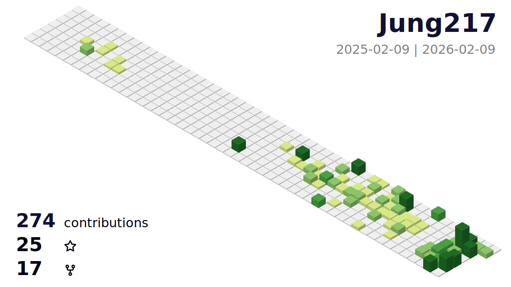

# GitHub Profile 3D Contrib Simplify

> This GitHub Action creates a GitHub contribution calendar on a 3D profile image.


## How to use (GitHub Actions) - Basic

> This GitHub Action generates your github profile 3d contribution calendar and commits to your repo.
After adding the GitHub Action, the workflow runs automatically once a day.
You can also trigger the workflow manually.

## Step 1. Create special profile repository

Create a repository on GitHub with the same name as your username.

- For example, if the username is `octocat`, create a repository named `octocat/octocat`.
- See also [Managing your profile README](https://docs.github.com/en/account-and-profile/how-tos/setting-up-and-managing-your-github-profile/customizing-your-profile/managing-your-profile-readme)

In this repository, follow the steps below.

## Step 2. Create workflow file

Create a workflow file like the one below.

- .github/workflows/profile-3d-simplify.yml
    ```yaml:.github/workflows/profile-3d-simplify.yml
    name: GitHub-Profile-3D-Contrib-simplify
    
    on:
      schedule:
        - cron: "0 16 * * *"
      workflow_dispatch:
    
    jobs:
      build:
        runs-on: ubuntu-latest
        name: generate-github-profile-3d-contrib-simplify
        steps:
          - uses: actions/checkout@v3
    
          - uses: Jung217/github-profile-3d-contrib-simplify@v0.1.1
            env:
              GITHUB_TOKEN: ${{ secrets.GITHUB_TOKEN }}
              USERNAME: ${{ github.repository_owner }}
    
          - name: Commit & Push
            run: |
              git config user.name github-actions
              git config user.email github-actions@github.com
              git add -A .
              git commit -m "generated" || echo "No changes"
              git push
    ```

> [!NOTE]
> The `secrets.GITHUB_TOKEN` is a special access token automatically created by GitHub.
> You can change your token to include contributions from private repositories.
> 
> To do this, go to your **profile picture (top right) → Settings → Developer Settings → Personal access tokens → tokens (classic) → Generate new token → Generate new token (classic)**, check like the picture shows, then **Generate token** and **Copy**.
> 
> 
>
> After get the token, go back to your "username repo" and add a **New Repository Secret**, then change into your own token.
>
> 
```diff
          env:
-           GITHUB_TOKEN: ${{ secrets.GITHUB_TOKEN }}
+           GITHUB_TOKEN: ${{ secrets.PAT_TOKEN }}
            USERNAME: ${{ github.repository_owner }}
```

> The schedule is set to run once a day by default.
> You can change the scheduled time as you like.

> This will add the workflow to your repository.

### Environment variables

In the sample, only `GITHUB_TOKEN` and `USERNAME` are specified as environment variables, but you can specify the following environment variables:

- `GITHUB_TOKEN` : (required) access token
- `USERNAME` : (required) target username (or specify with an argument).
- `MAX_REPOS` : (optional) max repositories, default 100 - since ver. 0.2.0
- `SETTING_JSON` : (optional) settings json file path. See `sample-settings/*.json` and `src/type.ts` in `yoshi389111/github-profile-3d-contrib-simplify` repository for details. - since ver. 0.6.0
- `GITHUB_ENDPOINT` : (optional) Github GraphQL endpoint. For example, if you want to create a contribution calendar based on your company's GitHub Enterprise activity instead of GitHub.com, set this environment variable. e.g. `https://github.mycompany.com/api/graphql` - since ver. 0.8.0
- `YEAR` : (optional) For past calendars, specify the year. This is intended to be specified when running the tool from the command line. - since ver. 0.8.0

### About the time to schedule

In the sample, it is set to start at 16:00 UTC.

```yaml
on:
  schedule: # 00:00 TW (UTC+8) == 16:00 UTC
    - cron: "0 16 * * *"
```

You can change it to any time you like.
We recommend midnight (around 3am) your local time.
However, please note that the time must be specified in UTC.

## Step 3. Manually run this GitHub Action

The first time, run this workflow manually.

- `Actions` -> `GitHub-Profile-3D-Contrib-simplify` -> `Run workflow`

The profile images are generated at the following paths:

- profile-3d-contrib-simplify/profile-day-rainbow.svg
    
- profile-3d-contrib-simplify/profile-gitblock.svg
    
- profile-3d-contrib-simplify/profile-green.svg
    
- profile-3d-contrib-simplify/profile-season.svg
    
- profile-3d-contrib-simplify/profile-south-season.svg
    
- profile-3d-contrib-simplify/profile-night-green.svg
    
- profile-3d-contrib-simplify/profile-night-rainbow.svg
    
- profile-3d-contrib-simplify/profile-night-view.svg
    

> If you specify the `SETTING_JSON` environment variable without a `fileName` property in the json file, the following image will be generated:
> 
> - `profile-3d-contrib-simplify/profile-customize.svg`

## Step 4. Add image to README.md

Add the path to the generated image in your README file.

```md

```

## How to use (GitHub Actions) - Advanced examples

- More info in [EXAMPLES.md](./EXAMPLES.md)

## How to use (local)

1. Set the `GITHUB_TOKEN` environment variable to your personal access token.
    ```powershell
    $env:GITHUB_TOKEN="XXXXXXXXXXXXXXXXXXXXXXXXXXXXXXXXXXXXXXXX"
    ```

2. Run the following command, replacing `USER_NAME` with your GitHub username or the target username.
    ```sh
    npx ts-node src/index.ts USER_NAME
    ```
